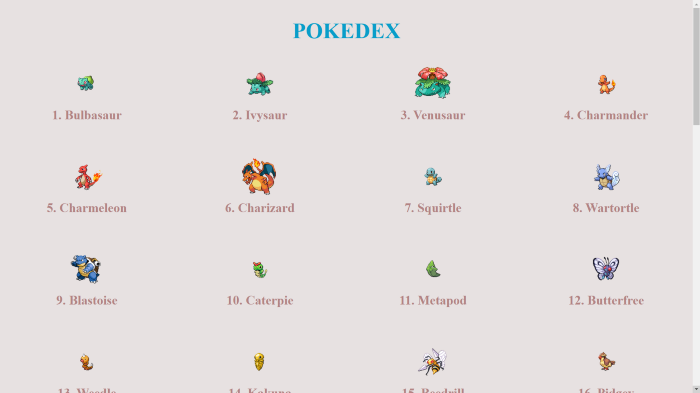
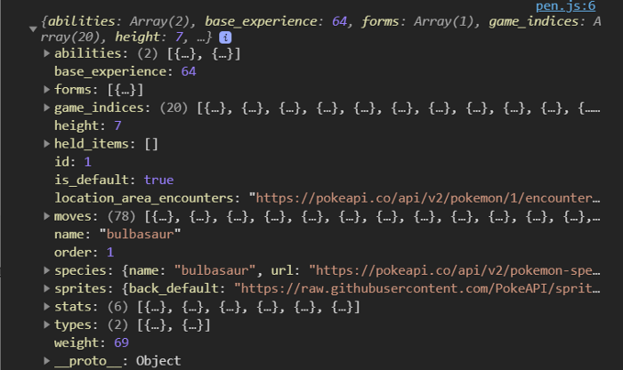
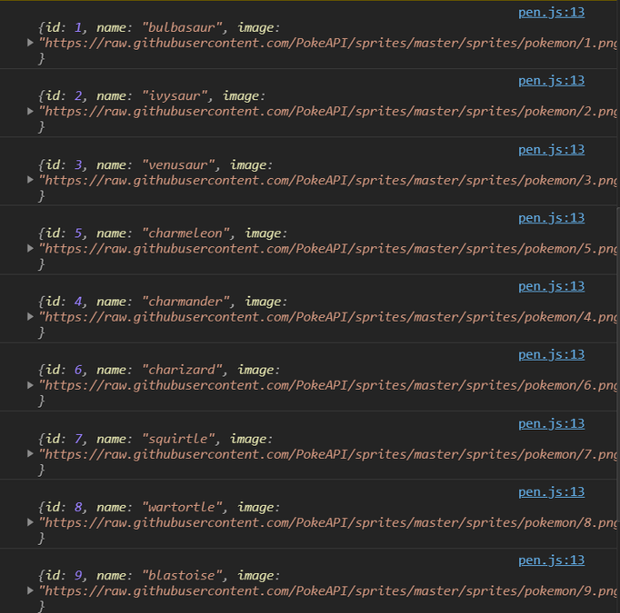
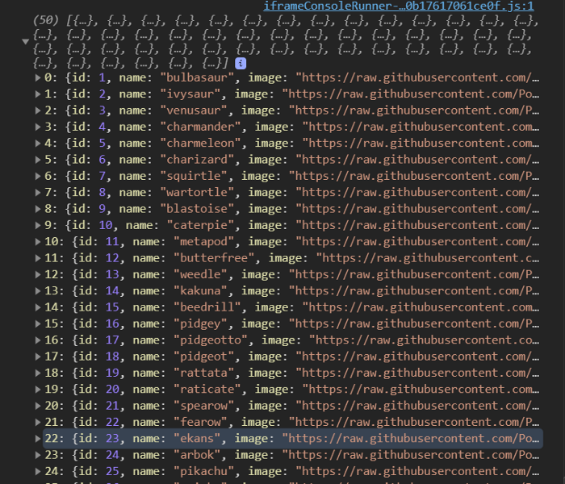

Who doesn’t like Pokemon? Well no one!! 😍

This was one of my favorite shows which I used to watch in my childhood.

So, let’s create a deck of some of the pokemons using HTML, CSS and JavaScript.

Since I explained some of the famous AJAX requests methods in my previous blog, so for fetching the data about our pokemons, we are going to use Fetch API.

If you don’t know what Fetch is or maybe you forgot about it, well you can read my last blog to get basic understanding of it or refresh your knowledge about it. 👇

[(Ajax 4 Way Requests)](https://medium.com/@vivekmittal199/ajax-4-way-requests-a9dd5531093e)

---

## What we will create & learn?

We are going to create a Pokemon Deck with a total of 50 pokemons in it with their name, id and image.

Through this, we will learn following things:

- Fetching data from an API
- Promises in JavaScript
- Writing HTML inside JavaScript

Our final project will look like this:



> So lets dive right in!

---

We will create a new folder and place our index.html, style.css and app.js file in it.

In our index.html, we are going to create an **unordered list** with an id of _pokedex_

Well, that’s it for our html file and it will look like this:

```html
<!DOCTYPE html>
<html lang="en">
  <head>
    <meta charset="UTF-8" />
    <meta name="viewport" content="width=device-width, initial-scale=1.0" />
    <title>Pokedex</title>
    <link rel="stylesheet" href="style.css" />
  </head>
  <body>
    <h1>Pokedex</h1>
    <ul id="pokedex"></ul>
    <script src="app.js"></script>
  </body>
</html>
```

Since, the CSS file is somewhat lengthy and my main focus here is not styling but JS, so I’ll not paste it here but you can access it from my github repo or else try styling it on your own (I know you can do it 😉).

---

## 1. Fetching data from an API

The API I’m using for fetching pokemon data is [https://pokeapi.co/api/v2/pokemon/](https://pokeapi.co/api/v2/pokemon/)

So our app.js will look like this:

```js
const getPokemon = () => {
  const url = "https://pokeapi.co/api/v2/pokemon/1"
  fetch(url)
    .then(res => res.json())
    .then(data => console.log(data))
}
getPokemon()
```

As you can see I’ve added a number ‘1’ at the end of my url, it is the id of that pokemon. There are 500+ pokemons stored here and we are not going to fetch every single one of them. For this project we will fetch the data of starting 50 only.

Okay, so the above code will return an object with many properties:



Here the important properties for us are _id_, _name_ and _image_. But wait… there is no _image_ property !! 🤨

Well, the image is stored in sprites with a property of _front_default_.

Okay, so we are able to fetch the data of a specific pokemon using its id at the end of the URL.

_So how to fetch the data of 50 pokemons?_ We can use a _for loop_ and iterate over each and every pokemon and then `console.log()` it to see what happens.

Our code will look like this:

```js
const getPokemon = () => {
  for (let i = 1; i <= 50; i++) {
    const url = `https://pokeapi.co/api/v2/pokemon/${i}`
    fetch(url)
      .then(res => res.json())
      .then(data => console.log(data))
  }
}
getPokemon()
```

Here, we are looping through the starting 50 pokemons.
There is something called [Template Literals](https://developer.mozilla.org/en-US/docs/Web/JavaScript/Reference/Template_literals) in JavaScript with the help of which we are able destructor our URL and use our i variable inside it.

Since, we want only id, name and image of every pokemon, so we will create an empty object and store these properties in that object.

The code will look like this:

```js
const getPokemon = () => {
  for (let i = 1; i <= 50; i++) {
    const url = `https://pokeapi.co/api/v2/pokemon/${i}`
    fetch(url)
      .then(res => res.json())
      .then(data => {
        const pokemon = {}
        pokemon["id"] = data.id
        pokemon["name"] = data.name
        pokemon["image"] = data.sprites["front_default"]

        console.log(pokemon)
      })
  }
}
getPokemon()
```

The result will be:



So now we are able to extract the properties which we need.
Let’s say instead of accessing 50 pokemons, what if we were to access 500 pokemons?

It will take quite a time, and we won’t we able to do anything until this for loop finishes. So this is bad and that’s why we use something called _Promises_.

---

## 2. Promises in JavaScript

Suppose we are fetching data of 500 pokemons, and the total time taken by all the pokemons is 500, but if we use _Promise_ then the total time taken will be equal to the max time taken by an individual pokemon and instead of fetching data in a sequential manner, it will fetch data parallelly and hence save our time.

> This was just my simple way of explaining promise. For a detailed explanation on Promise, you can visit [official MDN docs.](https://developer.mozilla.org/en-US/docs/Web/JavaScript/Reference/Global_Objects/Promise)

We are going to use `Promise.all()` which will basically return a promise that resolves once all the passed in promises have resolved (i.e. successfully fetched).

We will start by having an empty array of Promises outside our for loop. Inside the for loop, we will push the promise which is returned when `fetch()` is used. Like that we will push all our 50 promises inside that array.

Now we will use `Promise.all()` method by passing promises array as an argument and do a `.then()` and move that pokemon object we created.

So the code will look like this:

```js
const getPokemon = () => {
  const promises = []

  for (let i = 1; i <= 50; i++) {
    const url = `https://pokeapi.co/api/v2/pokemon/${i}`
    promises.push(fetch(url).then(res => res.json()))
  }

  Promise.all(promises).then(result => {
    const pokemon = result.map(data => ({
      id: data.id,
      name: data.name,
      image: data.sprites["front_default"],
    }))

    console.log(pokemon)
  })
}
getPokemon()
```

Here we are creating the pokemon object by using a JavaScript inbuilt `map()` function which will map over all the items in the array.

After logging it to the console, we will get something like this:



Yay! Our object is created and we are done with fetching the data. 🥳

---

## 3. Writing HTML inside JavaScript

Our final step is rendering this data on our screen.

Remember, in our HTML file, we created an _unordered list._ We are going to render all this data in that list.

First, we need to select that list, and we will use `document.getElementById()` for that.

Now, I’m going to create another function called `displayPokemon()` and it will take pokemon object as an argument and then we will create a string inside of this function and render all our html inside of it.

We are going to use our `map()` again and render a `<li>...</li>`

Final code looks like this:

```js
const pokedex = document.getElementById("pokedex")
const getPokemon = () => {
  const promises = []

  for (let i = 1; i <= 50; i++) {
    const url = `https://pokeapi.co/api/v2/pokemon/${i}`
    promises.push(fetch(url).then(res => res.json()))
  }

  Promise.all(promises).then(result => {
    const pokemon = result.map(data => ({
      id: data.id,
      name: data.name,
      image: data.sprites["front_default"],
    }))
    displayPokemon(pokemon)
  })
}
const displayPokemon = pokemon => {
  const pokemonString = pokemon
    .map(
      singlePokemon => `
    <li>
      
      <h3>${singlePokemon.id}. ${singlePokemon.name}</h3>
    </li>`
    )
    .join("")

  pokedex.innerHTML = pokemonString
}
getPokemon()
```

So we are able to write HTML inside JS using template literals which we used for our URL.

> Since a map function returns an array, so we used `.join("")` to convert it into a single string.

We are using _innerHTML_ to change the content of list to the created string.

Finally, we need to call `displayPokemon()` inside of our `Promise.all()`

## And we are done!! 🥳

---

Final Project Codepen Link: [Click here](https://codepen.io/vivek-mittal/pen/ExVMWOp)

> Happy Coding!
